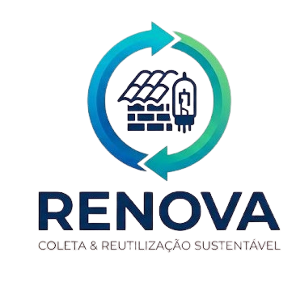

# ♻️ RENOVA - Coleção & Reutilização Sustentável



## 📖 Sobre o Projeto

**RENOVA** é uma plataforma web que conecta pessoas que querem doar ou negociar itens que não usam mais com quem precisa. O objetivo é promover a **economia circular** e a **sustentabilidade**, dando uma segunda vida para telhas, móveis, eletrônicos, entulho e muito mais.

> 📌 **Projeto desenvolvido como parte do processo seletivo MOVI TALENT - Fase 2**

---

## 🎯 Problema Resolvido

Marcos trocou o telhado de sua casa e ficou com **100m² de telhas romanas ocupando espaço**. Maria precisa trocar o telhado mas não tem dinheiro para telhas novas. Empresas de reciclagem também querem retirar o material.

**O RENOVA conecta essas pessoas!**

---

## ✨ Funcionalidades Implementadas

### ✅ Core do Sistema
| Funcionalidade | Status |
|----------------|--------|
| Cadastro de usuários | ✅ Completo |
| Login com validação | ✅ Completo |
| Dashboard com itens disponíveis | ✅ Completo |
| Filtros por categoria e busca | ✅ Completo |
| Sistema de lances (3 formatos) | ✅ Completo |
| Anunciar novos itens | ✅ Completo |
| Perfil do usuário | ✅ Completo |
| Meus itens (gerenciar anúncios) | ✅ Completo |
| Cancelar anúncio | ✅ Completo |
| Mensagens de erro/sucesso (Toast) | ✅ Completo |

### 💰 Sistema de Lances
- **💰 PAGO**: "Tenho interesse e pago R$ XX"
- **🎁 GRÁTIS**: "Tenho interesse e retiro grátis"
- **🚚 COBRANÇA**: "Cobro R$ XX para retirar e destinar"

### ⏱️ Prazo dos Anúncios
- 24 horas
- 1 semana
- 15 dias (padrão)
- 1 mês

---

## 🛠️ Tecnologias Utilizadas

| Tecnologia | Descrição |
|------------|-----------|
| **HTML5** | Estrutura das páginas |
| **CSS3** | Estilização e identidade visual |
| **Bootstrap 5** | Layout responsivo e componentes |
| **JavaScript (Vanilla)** | Lógica do sistema e interatividade |
| **SessionStorage** | Persistência de sessão do usuário |

---

## 🚀 Como Executar o Projeto

### Opção 1: Localmente
1. Clone o repositório:
```bash
git clone https://github.com/gio488/Projeto-MoviTalent.git
